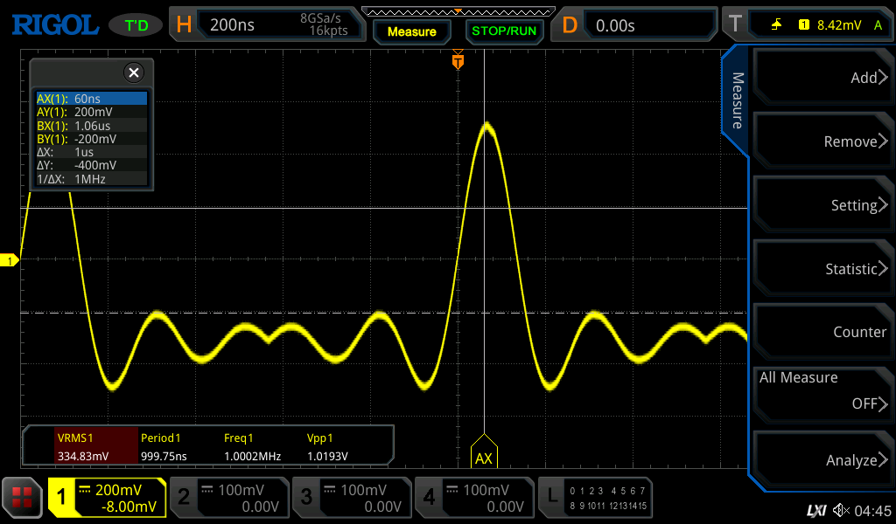

# SkippyMCP

An [MCP](https://modelcontextprotocol.io) (Model Context Protocol) server for
controlling Rigol oscilloscopes from an AI assistant. SkippyMCP translates MCP
tool calls into [SCPI](https://en.wikipedia.org/wiki/Standard_Commands_for_Programmable_Instruments)
commands over [PyVISA](https://pyvisa.readthedocs.io/), so an assistant can
configure channels and triggers, arm captures, read measurements, grab
screenshots, pull waveform data, and read protocol-decode results.

The name is a nod to SCPI — pronounced *"skippy"* in the test-and-measurement
world.



*Live capture: an AI assistant configured the channel and trigger, ran the
acquisition, measured it (Vpp 1.02 V, ~1 MHz), and pulled this screenshot — all
through SkippyMCP's MCP tools.*

- **Project name:** SkippyMCP
- **Executable:** `skippy-mcp`
- **Primary target:** Rigol **MSO5204** (MSO5000 series); a per-series dialect
  layer keeps other Rigol DSO/MSO families addable.
- **Status:** validated live against a real MSO5204; serves MCP over HTTP
  (Streamable HTTP) with optional Bearer-key auth and TLS.

## Install

```bash
python3 -m venv .venv
.venv/bin/pip install -e ".[dev]"
```

## Run

The server speaks MCP over **HTTP** (Streamable HTTP) at `/mcp`:

```bash
skippy-mcp --host 192.168.1.50            # plain HTTP on 127.0.0.1:8080 (loopback only)
skippy-mcp --host 192.168.1.50 --bind 0.0.0.0   # expose on the LAN (see security note)
skippy-mcp --resource TCPIP0::scope::5555::SOCKET --port 9000
skippy-mcp --config skippy.json           # API key / TLS / address from JSON
```

| Flag | Default | Effect |
|------|---------|--------|
| `--host` / `--resource` | — | Instrument address (CLI overrides the config file). |
| `--bind` | `127.0.0.1` | HTTP bind address. Use `0.0.0.0` to expose on the LAN. |
| `--port` | `8080` | HTTP port. |
| `--timeout-ms` | 300000 | Per-I/O VISA timeout in ms. `0` = wait forever (handy for long single-shots). |
| `--no-reset` | reset on | Skip `*RST` on connect; leave the setup untouched. |
| `--allow-raw-scpi` | off | Register the `scpi_raw` escape-hatch tool. |
| `--config <path>` | none | Optional JSON config (below). |

### Security defaults

- **Binds loopback (`127.0.0.1`) by default.** Pass `--bind 0.0.0.0` to expose the
  server on the network. If you do so **without** an `api_key`, the server starts but
  prints a loud warning — anyone who can reach the port can control the instrument.
- **DNS-rebinding protection is always on.** Requests are accepted only if their `Host`
  header matches the bind address or localhost (any port). Add other names a client may
  use (a LAN hostname, or anything when bound to `0.0.0.0`) via `allowed_hosts`; add
  browser `Origin` values via `allowed_origins`.
- **An `api_key` over plain HTTP is sent in cleartext** — the server warns; enable `tls`
  for confidentiality.

### Per-request timeout

Each tool call uses the `--timeout-ms` value as its per-I/O timeout, so a hung query (e.g.
the scope is busy) surfaces an actionable timeout error naming the last command rather than
hanging. A client may override the timeout for a single call with the
`X-Skippy-Timeout-Ms` request header (`0` = wait forever) — useful when arming a long
single-shot capture. This header is a SkippyMCP extension, not part of the MCP spec.

### Config file (`--config`)

All keys optional. No file → plain HTTP, no auth.

```json
{
  "host": "192.168.1.50",
  "resource": "TCPIP0::192.168.1.50::5555::SOCKET",
  "api_key": "your-bearer-token",
  "tls": { "cert": "/path/cert.pem", "key": "/path/key.pem" },
  "allowed_hosts": ["scope-host.lan:*"],
  "allowed_origins": ["https://app.example.com"]
}
```

- `api_key` set → require `Authorization: Bearer <key>` on every request.
- `tls` set → serve HTTPS directly (no reverse proxy needed).
- `allowed_hosts` / `allowed_origins` → extra `Host` / `Origin` values accepted by the
  DNS-rebinding guard (localhost and the bind address are always accepted; a `host:*`
  entry matches any port). Needed for access via a LAN hostname or when bound to `0.0.0.0`.
- Address precedence: `--resource` > `--host` > JSON `resource` > JSON `host`.

The startup banner reports the active mode (TLS / API key) and prints an example
smoke-test `curl`.

Ready-to-edit examples for each mode live in
[`examples/json-configuration/`](examples/json-configuration/):

| File | Mode |
|------|------|
| [`http-apikey.json`](examples/json-configuration/http-apikey.json) | HTTP + Bearer API key |
| [`https-tls.json`](examples/json-configuration/https-tls.json) | HTTPS/TLS, no auth |
| [`https-tls-apikey.json`](examples/json-configuration/https-tls-apikey.json) | HTTPS/TLS + Bearer API key |

### Generating a self-signed TLS certificate

For local/LAN testing you can make a self-signed cert and key. Include the
address you'll connect to in the `subjectAltName` so clients can verify it:

```bash
openssl req -x509 -newkey rsa:2048 -nodes -days 365 \
  -keyout key.pem -out cert.pem \
  -subj "/CN=localhost" \
  -addext "subjectAltName=IP:127.0.0.1,DNS:localhost"
```

Point `tls.cert` / `tls.key` at the resulting files. Clients that don't already
trust the cert can be told to with `SSL_CERT_FILE=cert.pem`. In Docker, the cert
and key must be **readable by the container's non-root user** (e.g. `chmod 644`).
For production, prefer a CA-issued certificate over a self-signed one.

## Docker

```bash
docker build -t skippy-mcp:latest .
# --network host reaches a link-local / same-LAN instrument. Bind 0.0.0.0 so the API
# is reachable from outside the container (it defaults to loopback); pair with an
# api_key in --config when doing so:
docker run --rm --network host skippy-mcp:latest \
  --resource TCPIP0::<scope-ip>::5555::SOCKET --port 8080 --bind 0.0.0.0
```

The image is pure-Python (`pyvisa-py`) and runs as a non-root user.

## Tools

Required arguments are **bold**. Enum values are the client-facing names.

| Tool | Arguments | Returns |
|------|-----------|---------|
| `get_identity` | — | `manufacturer`, `model`, `serial`, `firmware`, `dialect` |
| `configure_channel` | **`channel`** (1–4), `enabled`, `scale_v_per_div`, `offset_v`, `coupling` (`dc`/`ac`/`gnd`), `bandwidth_limit`, `probe_ratio` | `{status, channel}` |
| `configure_logic` | **`channels`** (`[0..15]`), `enabled`, `threshold_v`, `label` | `{status, channels}` |
| `configure_trigger` | **`mode`** (`edge`/`pulse`/`pattern`), `source`, `slope` (`rising`/`falling`/`either`), `level_v`, `pattern` | `{status, mode}` (only `edge` is fully implemented) |
| `capture` | **`action`** (`run`/`stop`/`single`) | `{status, action}` |
| `measure` | **`type`** (`vpp`/`vrms`/`freq`/`period`/`duty`/`rise`/`fall`/`delay`/`phase`), **`source`** (`CH1..CH4`), `source2` | `{type, source, value, unit}` |
| `screenshot` | — | PNG image (MCP image content, base64) |
| `read_waveform` | **`source`** (`CH1..CH4`/`D0..D15`), `mode` (`normal`/`raw`/`max`), `max_points` | `{source, x_unit, y_unit, x_increment, x_origin, values[]}` |
| `decode_bus` | **`bus`** (1–2), **`protocol`** (`i2c`/`spi`/`uart`/`parallel`/`can`/`lin`), `scl_source`, `sda_source`, `scl_threshold_v`, `sda_threshold_v`, `address_mode` (`normal`/`rw`), `format` (`hex`/`dec`/`bin`/`ascii`), `config` | `{frames[]}` |
| `scpi_raw` *(gated: `--allow-raw-scpi`)* | **`command`**, `expect_response` | `{response}` |

> **Serial decode is still in development.** `decode_bus` accepts typed I2C
> decoder configuration (sources, thresholds, address mode, display format) —
> validated against the simulator, with live hardware validation pending. I2C
> trigger support and structured frame parsing are scoped in the
> [I2C decode/trigger design doc](claude-design/20260627B-i2c-decode-trigger-feature.md).

## Example MCP calls

Transport is **MCP Streamable HTTP** at `/mcp`. After `initialize`, every request
carries the `Mcp-Session-Id` from the initialize response headers. Responses are
SSE — the JSON-RPC object is on the `data:` line; each tool result returns the
JSON document shown below in `result.content[0]` (`screenshot` returns an image
content block instead).

```bash
URL=http://127.0.0.1:8080/mcp
HJSON='-H Content-Type:application/json -H Accept:application/json,text/event-stream'
# (add  -H "Authorization: Bearer $KEY"  to every call when an api_key is set)

# initialize — capture the session id from the response headers
curl -sS -L -D /tmp/h $HJSON "$URL" \
  -d '{"jsonrpc":"2.0","id":1,"method":"initialize","params":{"protocolVersion":"2024-11-05","capabilities":{},"clientInfo":{"name":"demo","version":"1.0"}}}'
SID=$(awk -F': ' 'tolower($1)=="mcp-session-id"{print $2}' /tmp/h | tr -d '\r')
HSID="-H Mcp-Session-Id:$SID"
curl -sS -L $HJSON $HSID "$URL" -d '{"jsonrpc":"2.0","method":"notifications/initialized"}'
```

Each tool call is a `tools/call` POST with the same headers, e.g.:

```bash
curl -sS -L $HJSON $HSID "$URL" \
  -d '{"jsonrpc":"2.0","id":2,"method":"tools/call","params":{"name":"get_identity","arguments":{}}}'
```

The `arguments` object and the returned JSON for each tool:

**get_identity** — `{}` →
```json
{ "manufacturer": "RIGOL TECHNOLOGIES", "model": "MSO5204",
  "serial": "MS5Axxxxxxxxx", "firmware": "00.01.03.02.02", "dialect": "MSO5000" }
```

**configure_channel** — `{"channel":1,"enabled":true,"scale_v_per_div":0.5,"coupling":"dc","probe_ratio":10}` →
```json
{ "status": "ok", "channel": 1 }
```

**configure_logic** — `{"channels":[0,1,2,3],"enabled":true,"threshold_v":1.4}` →
```json
{ "status": "ok", "channels": [0, 1, 2, 3] }
```

**configure_trigger** — `{"mode":"edge","source":"CH1","slope":"rising","level_v":0.0}` →
```json
{ "status": "ok", "mode": "edge" }
```

**capture** — `{"action":"single"}` →
```json
{ "status": "ok", "action": "single" }
```

**measure** — `{"type":"freq","source":"CH1"}` →
```json
{ "type": "freq", "source": "CH1", "value": 1000000.0, "unit": "Hz" }
```

**screenshot** — `{}` → an MCP **image** content block (base64 PNG), e.g.
`{ "type": "image", "mimeType": "image/png", "data": "iVBORw0KGgo..." }`

**read_waveform** — `{"source":"CH1","mode":"normal","max_points":1200}` →
```json
{ "source": "CH1", "x_unit": "s", "y_unit": "V",
  "x_increment": 4e-10, "x_origin": -2.0e-7,
  "values": [0.001, 0.004, 0.010, "...1200 points..."] }
```

**decode_bus** — `{"bus":1,"protocol":"i2c"}` →
```json
{ "frames": [ { "time": 1.2e-5, "label": "ADDR", "data": "0x50" },
              { "time": 1.8e-5, "label": "DATA", "data": "0xA3" } ] }
```

**scpi_raw** *(requires `--allow-raw-scpi`)* — `{"command":"*IDN?","expect_response":true}` →
```json
{ "response": "RIGOL TECHNOLOGIES,MSO5204,MS5Axxxxxxxxx,00.01.03.02.02" }
```

> Tools that accept forward-compatible options not yet sent to the scope
> (`configure_logic`'s `label`, `decode_bus`'s `config`, non-`edge` triggers)
> echo an `"unimplemented": [...]` / `"status": "unimplemented"` field rather
> than silently ignoring the request.

## Develop / test

```bash
.venv/bin/pytest          # full suite, no hardware (uses the simulator)
.venv/bin/mypy            # strict type-check
.venv/bin/ruff check
```

## Documentation

| Document | Description |
|----------|-------------|
| [Initial design](claude-design/20260605A-skippy-mcp-initial-design.md) | Overview, architecture, tool surface, compatible models, prior art. |
| [Detailed design](claude-design/20260609A-skippy-mcp-detailed-design.md) | Layered architecture, transport interface + simulator, dialect layer, error model, tool schemas. |
| [Implementation plan](claude-design/20260609B-skippy-mcp-implementation-plan.md) | Phased build plan (hardware-free through Phase 6). |
| [Validation summary](claude-design/20260609C-skippy-mcp-validation-summary.md) | v0.1.0 test results + live MSO5204 validation. |
| [HTTP transport design](claude-design/20260609D-skippy-mcp-http-transport-design.md) | HTTP transport, config file, API-key auth, TLS (v0.2.0). |
| [I2C decode/trigger feature](claude-design/20260627B-i2c-decode-trigger-feature.md) | First-class I2C decode config + trigger: verified SCPI, phased plan, test-source rigs. **In development.** |

## License

[MIT](LICENSE) © 2026 Mark Deazley
